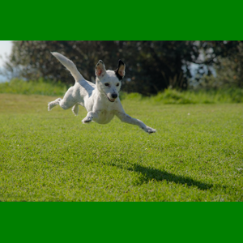

# eInk Radiator Image Source: Image


Generates an image from an existing image.

```bash
image generate --config config.json --height 300 --width 400
```

## Configuration

The configuration is the image source, which must be a publically accessible URL, the scaling algorithm (see below) and the background color (if required).

| field            | default | required | description |
|------------------|---------|----------|-------------|
| source           |         | Yes      | The URL to the image |
| scale            |         | Ye       | Algorithm to use when resizing the image to the desired resolution |
| background.color | white   | No       | The color of the background (used when contained images are a different resolution ratio) |

Possible options for `scale`:

* `resize` - Resize the image to fit the desired resolution. May lead to distortions.
* `contain` - Resize the image so the whole image fits inside the new resolution. May show some background, which will use the `background.color` configuration.
* `cover` - Resize the image so the smallest dimension fits inside the new resolution frame. May crop out some of the original image.

## Examples

### A resized image

```yaml
---
source: https://github.com/petewall/eink-radiator-image-source-image/raw/main/test/dog1.jpg
scale: resize
```


### A covered image

```yaml
---
source: https://github.com/petewall/eink-radiator-image-source-image/raw/main/test/dog3.jpg
scale: cover
```


### A contained image

```json
{
    "source": "https://github.com/petewall/eink-radiator-image-source-image/raw/main/test/dog2.jpg",
    "scale": "contain",
    "background": {
        "color": "green"
    }
}
```


